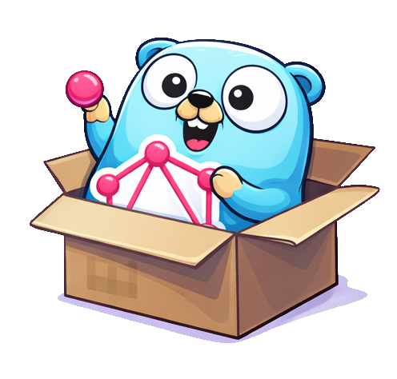

# Grapher

Create a set of easy‑to‑use Go packages that implement [full support for the September 2025 GraphQL Specification](https://spec.graphql.org/September2025/#).  This includes language grammar, execution semantics, type system, coercion rules, validation rules, and all other normative behaviors defined in the spec. :contentReference[oaicite:1]{index=1}

The implementation will be **low‑level, spec‑compliant, and library‑oriented**, suitable for both standalone GraphQL servers and use as a **federated subgraph** in a broader architecture.

---
## **High‑Level Architecture**

### Core Specification Compliance**
- Base everything on the **September 2025 GraphQL specification** as the authoritative source.
- Ensure all parsing, execution, coercion, and validation rules follow the official grammar and algorithms.
- Reference sections such as language grammar, input values, coercion rules, execution semantics, and validation rules directly in implementation decisions.

---

## **Major Functional Components**

### **1. Query Language Parser** 
- Tokenize and parse GraphQL documents according to the spec’s grammar. ([Language / Document Structure](https://spec.graphql.org/September2025/#2Language))
- Produce an abstract syntax tree (AST) representing operations, fragments, variables, directives, and selections. ([Language / Document Structure](https://spec.graphql.org/September2025/#2Language))
- Must handle all valid syntax, including nested queries, fragments, and variable usages. ([Language / Document Structure](https://spec.graphql.org/September2025/#2Language))

### **2. Schema Model**
- Represent types, scalars, enums, interfaces, unions, input objects, lists, and non‑null types according to the spec’s type system. ([Type System](https://spec.graphql.org/September2025/#3-Type-System))
- Include introspection types compliant with the spec (e.g., `__Type`, `__InputValue`). ([Introspection System](https://spec.graphql.org/September2025/#4-Introspection))

### **3. Resolver & Execution Engine**
- Execute parsed operations by resolving fields against a defined schema. ([Execution Semantics](https://spec.graphql.org/September2025/#6-Execution))
- Implement execution order, field collection, null propagation, and result coercion rules as specified. ([Execution Semantics](https://spec.graphql.org/September2025/#6-Execution))
- Perform variable substitution and coercion according to spec rules. ([Input Values](https://spec.graphql.org/September2025/#2.10Input-Values))

### **4. Input Coercion & Validation**
- Validate literal values and variables against expected input types. ([Input Values](https://spec.graphql.org/September2025/#2.10Input-Values))
- Apply input coercion rules for scalars, enums, lists, and input objects. ([Input Values](https://spec.graphql.org/September2025/#2.10Input-Values))
- Enforce rules such as required non‑null fields in input objects and input object field uniqueness. ([Input Values](https://spec.graphql.org/September2025/#2.10Input-Values))

### **5. Error Handling and Validation**
- Perform all specification‑defined validation steps before execution (e.g., catch invalid syntax, incorrect fields, type mismatches). ([Validation Rules](https://spec.graphql.org/September2025/#5-Validation))
- Produce error responses compliant with GraphQL error‑response format. ([Response Format](https://spec.graphql.org/September2025/#7-Response))
- Preserve response ordering where required for legibility. ([Execution Semantics](https://spec.graphql.org/September2025/#6-Execution))

### **6. HTTP Transport Layer**
- Expose a compliant GraphQL‑over‑HTTP interface. ([Transport Layer](https://spec.graphql.org/September2025/#7-Response))
- Support batching and multipart requests as specified (if part of the official spec for HTTP transport). ([Transport Layer](https://spec.graphql.org/September2025/#7-Response))

### **7. Federated Subgraph Support**
- Later extend the core GraphQL implementation to support federation semantics:
  - Export SDL.
  - Resolve entities based on federation keys.
  - Provide federation‑specific introspection hooks and semantics.
  - Integrate smoothly with Apollo Gateway or similar orchestrators. ([Federation / Subgraph Guidelines](https://www.apollographql.com/docs/federation/federation-spec/))

---

## **Planned Workflow**

1. **Spec Analysis**
   - Study the September 2025 spec in depth.
   - Map spec rules to implementation tasks and test cases.

2. **Parser & AST**
   - Build a parser that produces a complete AST for all valid GraphQL documents.
   - Ensure the parser catches syntax errors per spec.

3. **Type System**
   - Implement the GraphQL type system (scalars, enums, objects, input objects, interfaces, unions).
   - Support introspection types and directives.

4. **Execution Engine**
   - Create resolver abstractions and execution logic that follow spec semantics.

5. **Validation & Coercion**
   - Implement validation rules (type validation, uniqueness, required field checks).
   - Implement input coercion rules for all input types including lists and objects.

6. **Transport Layer**
   - Build a spec‑compliant HTTP server integration for GraphQL queries.

7. **Testing & Conformance**
   - Develop a test suite based on spec examples and edge cases.
   - Validate implementation against spec requirements.

8. **Federation/Subgraph**
   - Design and implement federation extensions once core spec compliance is complete.

---

## **Future Extensions**

- Support for mutations and subscriptions.
- Nested queries and complex argument handling.
- Authentication and authorization layers.
- Improved error handling and validation.
- Integration with databases or external APIs.
- Full Apollo Federation support as a modular subgraph.

---

## **Outcome**

By following this architecture, the project will provide:

- A **fully low-level, from-scratch GraphQL server in Go**.
- A **foundation for modular, federated GraphQL services**.
- Flexibility to expand, optimize, and integrate with larger systems.
